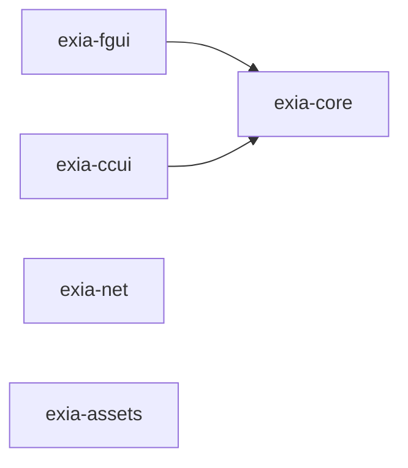

# exia-framework

exia-framework monorepo - Cocos Creator 游戏框架

一个模块化、类型安全、高性能的 Cocos Creator 游戏开发框架集合，提供从核心功能到高级特性的完整解决方案。

[!\[License\](https://img.shields.io/badge/license-MIT-blue.svg null)](LICENSE)
[!\[pnpm\](https://img.shields.io/badge/maintained%20with-pnpm-cc00ff.svg null)](https://pnpm.io/)

## ✨ 特性

- 🎯 **模块化设计** - 5 个独立模块，按需使用
- 📦 **Monorepo 架构** - 统一管理，独立发布
- 💪 **TypeScript** - 完整的类型定义和智能提示
- 🚀 **高性能** - 优化的数据结构和算法
- 🔧 **零配置** - 开箱即用，简单易用
- 📖 **完善文档** - 详细的 API 文档和示例

## 📦 模块总览

Exia Framework 包含 5 个核心模块，分为 5 大类别：

### 🏗️ 核心模块

| 模块            | npm 包名                                                             | 描述                                    | 文档                              |
| ------------- | ------------------------------------------------------------------ | ------------------------------------- | ------------------------------- |
| **exia-core** | [@xiacg/exia-core](https://www.npmjs.com/package/@xiacg/exia-core) | 框架核心功能库，提供 Time、Platform、Module 等基础工具 | [README](./exia-core/README.md) |

### 🎨 UI 模块

| 模块          | npm 包名                                                         | 描述                                | 文档                             |
| ----------- | -------------------------------------------------------------- | --------------------------------- | ------------------------------ |
| **exia-fgui** | [@xiacg/exia-fgui](https://www.npmjs.com/package/@xiacg/exia-fgui) | 基于 FairyGUI 的 UI 管理系统，支持窗口管理、装饰器等 | [R EADME](./exia-fgui/README.md) |
| **exia-ccui** | [@xiacg/exia-ccui](https://www.npmjs.com/package/@xiacg/exia-ccui) | 基于 Cocos Creator 的 UI 管理系统，支持窗口管理、装饰器等 | [R EADME](./exia-ccui/README.md) |

### 🎮 游戏架构模块

| 模块             | npm 包名                                                               | 描述                 | 文档                               |
| -------------- | -------------------------------------------------------------------- | ------------------ | -------------------------------- |
| **exia-event** | [@xiacg/exia-event](https://www.npmjs.com/package/@xiacg/exia-event) | 全局事件系统，支持优先级、批量操作等 | [README](./exia-event/README.md) |

### 🌐 网络与资源模块

| 模块              | npm 包名                                                                 | 描述                        | 文档                                |
| --------------- | ---------------------------------------------------------------------- | ------------------------- | --------------------------------- |
| **exia-net**    | [@xiacg/exia-net](https://www.npmjs.com/package/@xiacg/exia-net)       | 网络通信库，封装 HTTP 和 WebSocket | [README](./exia-net/README.md)    |
| **exia-assets** | [@xiacg/exia-assets](https://www.npmjs.com/package/@xiacg/exia-assets) | 资源加载管理，支持批量加载、进度跟踪等       | [README](./exia-assets/README.md) |

### 🛠️ 工具模块

| 模块     | npm 包名 | 描述     | 文档     |
| ------ | ------ | ------ | ------ |
| <br /> | <br /> | <br /> | <br /> |

## 📚 项目文档

- [架构设计文档](./ARCHITECTURE.md) - Monorepo 架构、模块分层和设计原则
- [构建与发布指南](./COMMANDS.md) - 开发、构建、发布完整流程

## 🎯 模块依赖关系



## 🚀 快速开始

### 环境要求

- **Node.js**: >= 16.0.0
- **pnpm**: >= 8.0.0
- **Cocos Creator**: 3.8.0+

### 方式一：在 Cocos Creator 项目中使用（推荐）

在你的 Cocos Creator 项目中直接安装需要的模块：

```bash
# 安装核心模块
npm install @xiacg/exia-core

# 安装 fgui 模块
npm install @xiacg/exia-fgui
# 安装 ccui 模块
npm install @xiacg/exia-ccui

# 安装 event 模块
npm install @xiacg/exia-event

# 或一次性安装多个模块
npm install @xiacg/exia-core @xiacg/exia-fgui @xiacg/exia-ccui @xiacg/exia-net @xiacg/exia-event @xiacg/exia-assets
```

### 方式二：本地开发此框架

如果你想参与框架开发或查看源码：

#### 1. 安装 pnpm

```bash
# 使用 npm 安装
npm install -g pnpm

# 或使用 homebrew (macOS)
brew install pnpm

# 验证安装
pnpm --version
```

#### 2. 克隆仓库并安装依赖

```bash
# 克隆仓库
git clone https://github.com/xiacg/exia-framework.git
cd exia-framework

# 安装所有依赖
pnpm install
```

#### 3. 构建所有模块

```bash
# 构建所有库
pnpm build:all
```

完整的开发、构建、发布流程请查看 [COMMANDS.md](./COMMANDS.md)

## 📝 版本管理

### 升级版本

```bash
# 升级补丁版本 (0.0.1 -> 0.0.2)
pnpm version:patch

# 升级次版本 (0.0.1 -> 0.1.0)
pnpm version:minor

# 升级主版本 (0.0.1 -> 1.0.0)
pnpm version:major
```

### 发布到 npm

```bash
# 发布 bit-core
pnpm publish:core

# 发布 bit-fgui
pnpm publish:fgui

# 注意：发布前需要：
# 1. 确保已登录 npm: npm login
# 2. 确保代码已提交
# 3. 确保版本号已更新
```

###

### 脚手架项目

- [Cocos Creator 3.8.x 游戏架构脚手架项目](https://github.com/xiachenggang/exia-framework-game.git)

## 🔧 常见问题

### Q: 模块之间有依赖关系吗？

A: 部分模块有依赖关系：

- `exia-fgui` 依赖 `exia-core`
- `exia-ccui` 依赖 `exia-core`

其他模块都是独立的，可以单独使用。

### Q: 为什么使用 pnpm？

A: pnpm 相比 npm/yarn 有以下优势：

- 更快的安装速度
- 节省磁盘空间（使用硬链接）
- 更严格的依赖管理
- 原生支持 monorepo

### Q: 支持哪些 Cocos Creator 版本？

A:

- **推荐版本**: Cocos Creator 3.8.x
- **最低支持**: Cocos Creator 3.7.0+
- **理论支持**: Cocos Creator 3.0+（部分功能可能需要调整）

### Q: 可以只使用部分模块吗？

A: 当然可以！所有模块都是独立发布的，你可以按需安装使用。只需要注意模块间的依赖关系即可。

### Q: 如何贡献代码？

A: 欢迎贡献！请按以下步骤：

1. Fork 本仓库
2. 创建你的特性分支 (`git checkout -b feature/AmazingFeature`)
3. 提交你的更改 (`git commit -m 'Add some AmazingFeature'`)
4. 推送到分支 (`git push origin feature/AmazingFeature`)
5. 开启一个 Pull Request

## 🔗 相关资源

- [pnpm 官方文档](https://pnpm.io/zh/)
- [pnpm workspace 文档](https://pnpm.io/zh/workspaces)
- [Cocos Creator 文档](https://docs.cocos.com/creator/3.8/)
- [FairyGUI 文档](https://www.fairygui.com/docs/editor)
- [TypeScript 文档](https://www.typescriptlang.org/zh/)

## 📄 许可证

MIT License - 详见 [LICENSE](LICENSE) 文件

## 👥 作者与贡献者

**作者**: xiacg (xiacg)

**联系方式**: <xiacg@163.com>
